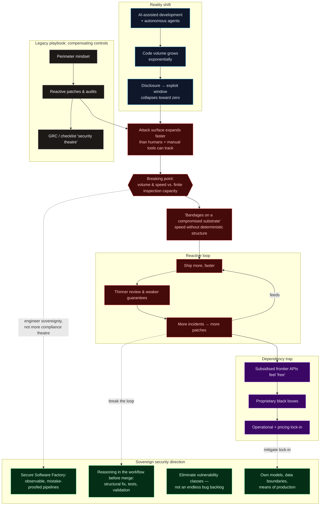

<head style="background-color: #0B1C2E;">
</head>

  <a href="https://devsecai.io" target="_blank">
    <picture>
      <source media="(prefers-color-scheme: dark)" srcset="/profile/project-ark-logo-dark.jpg">
      <source media="(prefers-color-scheme: light)" srcset="/profile/project-ark-logo-light.jpg">
      
    </picture>
  </a>

Developing a collective AI-Native defence playbook. Engineering sovereignty for the era of infinite code.

---

# Project Ark

**Developing a collective AI-Native defence playbook. Engineering sovereignty for the era of infinite code.**

Welcome to Project Ark. We are a collective of software security engineers, platform architects, and practitioners who recognise that the traditional cybersecurity paradigm has reached its breaking point.

**The Manifesto • North Star • Workstreams • Community**

## 📜 The manifesto
We believe that the compensating controls model — a legacy of reactive patches and perimeter defense — is fundamentally broken. In a world where AI-assisted development and autonomous agents are exponentially increasing code volumes, and time-to-exploit software vulnerabilities from public disclosure is collapsing to zero, the attack surface is expanding faster than any security inspector or manual audit can track and fix.

We believe the "compensating controls" model is not just failing; it is a reactive trap. As AI-assisted development and autonomous agents exponentially increase code volumes, the resulting attack surface expansion renders traditional security "bandages" impotent.

Optimising the application layer with faster patching tools is a race to the bottom. If we rely on speed alone without a deterministic, localised infrastructure, we are simply accelerating the rate at which we apply bandages to a fundamentally compromised substrate.

Project Ark is the implementation arm of a sovereign security movement. We will seek alternatives to being locked into the pricing models and proprietary black boxes of frontier model and security testing companies. Instead, we will share experiences building our own Secure Software Factories: high-observability, mistake-proofed pipelines that uses LLM-based reasoning to move beyond finding bugs to eliminating entire classes of vulnerabilities.

We don't just want faster tools for deployment teams; we want to hardcode the structural boundaries of our code and infrastructure. We will use a reasoning engine to ensure that security is not a post-script, but an immutably evident and deterministic property of the code itself.

## Why sovereignty?

> We believe that dependency on systems that are temporarily heavily subsidised will become a trap - organisations are going to get locked in. This can be mitigated by owning the means of production and in time, self-hosting our models locally. But it requires a better understanding of 1) how to provide tools in ways which experienced and new-developers alike want to include in their workflow and 2) which secure coding tasks are best suited to which types of AI model.

Project Ark exists to ensure that member organisations don't need to choose between operational cost, stability and safety and still enjoy the near-term benefits of using subsidised frontier company APIs. Together we will build templates for lean, secure software factories: making available AI-native tools and playbooks for local reasoning, and local preventative, detective and corrective action.

## 🛠️ The Strategy: Beyond the Reactive Loop
Inspired by healthcare's shift from "medication" to "structural health," our approach focuses on building explainable playbooks for engineering and executive teams for the following:

1. **IDE-smbedded sovereignty:** Reasoning agents are embedded directly into the developer workflow. Before code is even committed, it is inspected for vulnerabilities, a structural fix is written, tests are run, and the deployment is validated. The vulnerability is strangled at the source.

2. **Full-stack autonomous inspection:** Agents can run 24/7 across every layer of the grid—from bare-metal perimeters to application logic—identifying weaknesses and automatically reconfiguring production environments to mitigate risk while permanent, sovereign fixes are deployed.

3. **Ownership of the means of production:** We will build a path to mitigating vendor lock-in by designing the infrastructure to self-host models and orchestration. We believe our organisations will need to understand data and model boundaries rather than be wholly reliant on subsidised, third-party APIs that create operational dependencies.

## 🏗️ Workstreams (Subject to Discussion)
Our roadmap is organised into three strategic workstreams to ensure principled performance and structural resilience.

1. **Preventative: Mistake-proofing the factory**
**Focus:** Embedding Arko within the IDE and Agent Managers to "mistake-proof" the pipeline.
**Tactics:** Developing "Secure-by-Construction" templates where code and its security fix are submitted as a single, atomic unit.
**Goal:** Hardcoding the assembly line so that ....

2. **Detective: Continuous structural telemetry**
**Focus:** 24/7 autonomous agents inspecting the entire stack for drift and architectural fragility.
**Tactics:** Utilising self-hosted LLMs to map complex attack paths that traditional scanners miss, ensuring total visibility into the "Sovereign Substrate."
**Goal:** Transitioning from GRC "Security Theatre" to high-resolution, real-time awareness of the attack surface.

3. **Corrective: Sovereign configuration & refactoring**
**Focus:** Automated risk mitigation and structural remediation without human intervention.
**Tactics:** Deploying agents that can configure production environments in real-time to close exploit windows while simultaneously generating permanent code refactors.
**Goal:** Moving the enterprise into a state of structural remission where the underlying vulnerability classes are eliminated forever.

## 🤝 Join the Project
Project Ark is a vendor-neutral community designed for CISOs of software engineering companies and application security leads. We are the architects of our own sovereignty.

**Principles:** Mistake-proofing and defect prevention beats defect discovery.

**Tooling:** Standardised on DevSecAI Arko for reasoning-driven security - other tooling will be subject to the same onboarding criteria (zero cost to project participants).

**Compliance:** Built for the 2026 AI Code of Practice and UK and EU "Secure by Design" mandates.

## Structural overview

